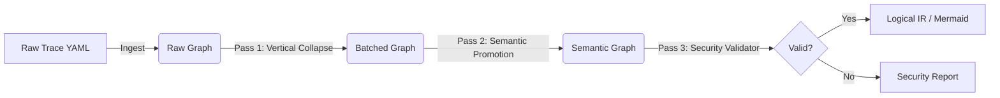

# 📔 Engineering Log: ETL Optimizer

**Project:** `etl-optimizer`
**Mission:** Transform low-level Execution Traces (Raw IR) into high-level, secure, and human-readable Logical State Machines (Logical IR).
**Core Principles:**

1. **Language Agnostic:** Inputs are YAML traces, not source code.
2. **Lossless Simplification:** Optimization must reduce complexity without losing lineage or logic.
3. **Security First:** The optimizer must enable stateful security validation.

---

## 🏗 Architecture Overview

We are building a pipeline of **Passes**. Each pass takes a graph and returns a cleaner, richer graph.

---

## ✅ TDD Checklist: The "Must Haves"

We will work through this list sequentially. Each item represents a distinct Test Suite.

### Phase 1: Ingestion & The "Raw" Model

* [ ] **Test 1.1:** Can load the `complex_pipeline.yaml` fixture into Pydantic models.
* [ ] **Test 1.2:** Can reconstruct the raw NetworkX graph from the models.
* [ ] **Test 1.3:** Can identify "Execution Barriers" (Materialize/Join/Save nodes) vs "Fluid Nodes" (Compute/Recode).

### Phase 2: The "Vertical Collapse" (The Optimization)

* [ ] **Test 2.1:** Detect a linear chain of `COMPUTE` nodes ().
* [ ] **Test 2.2:** Merge a chain into a single `BatchComputeNode` containing multiple expressions.
* [ ] **Test 2.3:** Verify that intermediate Datasets () are removed from the graph.
* [ ] **Test 2.4:** Ensure that "Side Effect" dependencies (e.g., if  was also used in a separate branch) prevent collapsing (Safety Check).

### Phase 3: Semantic Promotion (The Intelligence)

* [ ] **Test 3.1:** Identify `GENERIC` nodes with commands `IF`, `SORT`, `FILTER`.
* [ ] **Test 3.2:** Promote `IF` generic nodes to `FilterNode` or `ConditionalLogicNode`.
* [ ] **Test 3.3:** Promote `SORT` generic nodes to `SortNode`.
* [ ] **Test 3.4:** Verify schema consistency after promotion.

### Phase 4: Validation & Security (The Guard)

* [ ] **Test 4.1:** **Ghost Column Detector:** Fail if a node references a column not present in the Input Schema.
* [ ] **Test 4.2:** **Lineage Tracker:** Trace the origin of a specific output column back to Source.
* [ ] **Test 4.3:** **Barrier Check:** Ensure heavy operations (Joins) are preceded by necessary optimizations (Sorts/Filters).

### Phase 5: Visualization & Export

* [ ] **Test 5.1:** Generate a Mermaid diagram of the *Optimized* graph (Should be <10 nodes for the 60-step input).
* [ ] **Test 5.2:** Export the `Logical IR` to a clean YAML format suitable for SQL generation.

---

## 🛣️ The Roadmap

### Milestone 1: The "Collapser" (Phases 1 & 2)

**Goal:** Turn the 3000-line "Spaghetti Trace" into a "Lasagna Stack" (Layers of batched logic).

* **Input:** SpecGen Output (`trace.yaml`).
* **Key Logic:** `VerticalCollapser` class.
* **Success Metric:** Graph node count reduced by >80%.

### Milestone 2: The "Interpreter" (Phase 3)

**Goal:** Remove the "Generic/Gray Box" nodes. The graph should be purely semantic.

* **Key Logic:** `SemanticPromoter` class.
* **Success Metric:** Zero `GenericNode` types remaining in the high-level graph.

### Milestone 3: The "Auditor" (Phase 4)

**Goal:** Prove the pipeline is safe.

* **Key Logic:** `SecurityValidator` class.
* **Success Metric:** Ability to flag a "Use-Before-Def" error or a "Missing Sort" warning.

---

## 🚀 First Step

Create the repo and setting up the **First Fixture**.

1. Initialize `etl-optimizer`.
2. Create `tests/fixtures/raw_trace.yaml` (Paste your SpecGen output there).
3. Create `tests/unit/test_ingestion.py`.
