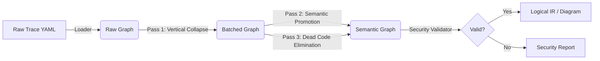

# etl_optimizer
etl_optimizer
### 📦 New Repo: `etl-optimizer`

**Mission:** Transform a low-level Execution Trace (thousands of steps) into a high-level Logical State Machine (dozens of states) for security validation and visualization.

### 1. The Transformation Strategy

We are moving from **Physical Execution** (what happened) to **Logical Intent** (what it means).

**Input (Trace IR - Repo 1 Output):**

* *Verbose, noisy, repetitive.*
* "Load A", "Compute A.1", "Compute A.2", "Compute A.3", "Materialize", "Filter".
* 3000 lines of YAML.

**Output (Logical IR - Repo 2 Output):**

* *Concise, semantic, secure.*
* "Ingest Dataset", "Apply Business Logic (Batch)", "Apply Quality Filter".
* 50 lines of YAML.

### 2. The Architecture

This repo should be structured as a pipeline of **Optimization Passes**.



### 3. Key Components

#### A. The "Vertical Collapse" Pass

This is the logic we discussed. It identifies linear chains of operations that do not require materialization (like `COMPUTE` -> `COMPUTE`) and merges them into a single **State Transition**.

* **Before:** 50 nodes of math.
* **After:** 1 node: `Transformation State` containing a list of formulae.

#### B. The "Semantic Promotion" Pass

This fixes the "Generic Node" problem from Repo 1. It looks at the context of generic nodes (like `IF` or `SORT`) and promotes them to first-class logical operators.

* *Context:* `SORT` followed by `JOIN`.
* *Inference:* This is a `Merge Sort Preparation`.

#### C. The Stateful Security Check (The "Guard")

Since we now have a clean graph, we can run policy checks:

1. **PII Leakage:** Does a variable tagged `sensitive` (like `dob`) flow into an output tagged `public` without being masked?
2. **Filter Logic:** Does the `eligible_days` filter happen *before* or *after* the payment calculation?
3. **Type Safety:** Are we subtracting a `Date` from an `Integer`?

### 4. Proposed `README.md` for Repo #2

---

# ETL Optimizer & Validator

> **A language-agnostic engine for optimizing and securing ETL dataflows.**

This tool ingests raw execution traces (from `SpecGen` or other parsers) and refines them into high-level Logical State Machines.

## 🚀 The Pipeline

### 1. Optimize

Reduces graph complexity by 90% via **Vertical Collapsing**.

* *Input:* 60-step SPSS trace.
* *Output:* 6-step Logical Dataflow.

### 2. Validate

Runs stateful static analysis on the optimized graph.

* **Schema Validity:** Ensures no "Ghost Columns" exist.
* **Type Safety:** Validates unit consistency (e.g., Seconds vs Days).
* **Security Policy:** Enforces PII masking rules.

### 3. Visualize

Generates simplified, executive-ready diagrams that show **Intent** rather than **Execution**.

## 🛠 Usage

```bash
# Optimize a raw trace
python optimize.py input_trace.yaml --output logical_flow.yaml

# Run security checks
python validate.py logical_flow.yaml --policy policies/ons_security.yaml

```

---

### 🚀 Next Step

Since you have the "Perfect Output" (the raw trace) from Repo 1, you can treat that file as a **fixture** for Repo 2.

**Action Plan:**

1. Create the new folder/repo `etl_optimizer`.
2. Copy your `complex_pipeline.yaml` (the output from the 60-step test) into `tests/fixtures/raw_trace.yaml`.
3. Begin writing the `VerticalCollapser` class.
