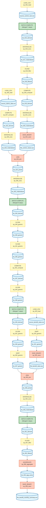

```mermaid
graph TD
    classDef dataset fill:#e1f5fe,stroke:#01579b,stroke-width:2px,rx:5,ry:5;
    classDef op fill:#fff9c4,stroke:#fbc02d,stroke-width:2px;
    classDef batch fill:#c8e6c9,stroke:#2e7d32,stroke-width:4px;
    classDef barrier fill:#ffccbc,stroke:#d84315,stroke-width:2px;
    source_control_vars.csv[("source_control_vars.csv")]:::dataset
    ds_015_derived[("ds_015_derived")]:::dataset
    ds_017_materialized[("ds_017_materialized")]:::dataset
    ds_018_filtered[("ds_018_filtered")]:::dataset
    ds_019_derived[("ds_019_derived")]:::dataset
    ds_020_materialized[("ds_020_materialized")]:::dataset
    file_control_values.sav[("file_control_values.sav")]:::dataset
    source_benefit_rates.csv[("source_benefit_rates.csv")]:::dataset
    ds_021_generic[("ds_021_generic")]:::dataset
    file_benefit_rates.sav[("file_benefit_rates.sav")]:::dataset
    source_claims_data.csv[("source_claims_data.csv")]:::dataset
    ds_022_derived[("ds_022_derived")]:::dataset
    ds_023_materialized[("ds_023_materialized")]:::dataset
    ds_024_joined[("ds_024_joined")]:::dataset
    ds_025_materialized[("ds_025_materialized")]:::dataset
    ds_034_derived[("ds_034_derived")]:::dataset
    ds_035_generic[("ds_035_generic")]:::dataset
    ds_036_generic[("ds_036_generic")]:::dataset
    ds_037_derived[("ds_037_derived")]:::dataset
    ds_038_generic[("ds_038_generic")]:::dataset
    ds_045_derived[("ds_045_derived")]:::dataset
    ds_046_generic[("ds_046_generic")]:::dataset
    ds_047_generic[("ds_047_generic")]:::dataset
    ds_048_joined[("ds_048_joined")]:::dataset
    ds_049_materialized[("ds_049_materialized")]:::dataset
    ds_051_derived[("ds_051_derived")]:::dataset
    ds_052_filtered[("ds_052_filtered")]:::dataset
    ds_053_agg_active[("ds_053_agg_active")]:::dataset
    file_benefit_monthly_summary.csv[("file_benefit_monthly_summary.csv")]:::dataset
    op_001_load["LOAD_CSV<br/>op_001_load"]:::op
    op_001_load --> source_control_vars.csv
    batch_op_002_compute["BATCH COMPUTE<br/>(Merged 7 steps)"]:::batch
    source_control_vars.csv --> batch_op_002_compute
    batch_op_002_compute --> ds_015_derived
    op_018_exec["MATERIALIZE<br/>op_018_exec"]:::op
    ds_015_derived --> op_018_exec
    op_018_exec --> ds_017_materialized
    op_019_filter["FILTER<br/>op_019_filter"]:::op
    ds_017_materialized --> op_019_filter
    op_019_filter --> ds_018_filtered
    op_020_compute["COMPUTE<br/>op_020_compute"]:::op
    ds_018_filtered --> op_020_compute
    op_020_compute --> ds_019_derived
    op_021_exec["MATERIALIZE<br/>op_021_exec"]:::op
    ds_019_derived --> op_021_exec
    op_021_exec --> ds_020_materialized
    op_022_save["SAVE_BINARY<br/>op_022_save"]:::barrier
    ds_020_materialized --> op_022_save
    op_022_save --> file_control_values.sav
    op_023_load["LOAD_CSV<br/>op_023_load"]:::op
    op_023_load --> source_benefit_rates.csv
    op_024_generic["SORT<br/>op_024_generic"]:::op
    source_benefit_rates.csv --> op_024_generic
    op_024_generic --> ds_021_generic
    op_025_save["SAVE_BINARY<br/>op_025_save"]:::barrier
    ds_021_generic --> op_025_save
    op_025_save --> file_benefit_rates.sav
    op_026_load["LOAD_CSV<br/>op_026_load"]:::op
    op_026_load --> source_claims_data.csv
    op_027_compute["COMPUTE<br/>op_027_compute"]:::op
    source_claims_data.csv --> op_027_compute
    op_027_compute --> ds_022_derived
    op_028_exec["MATERIALIZE<br/>op_028_exec"]:::op
    ds_022_derived --> op_028_exec
    op_028_exec --> ds_023_materialized
    op_029_join["JOIN<br/>op_029_join"]:::barrier
    ds_023_materialized --> op_029_join
    file_control_values.sav --> op_029_join
    op_029_join --> ds_024_joined
    op_030_exec["MATERIALIZE<br/>op_030_exec"]:::op
    ds_024_joined --> op_030_exec
    op_030_exec --> ds_025_materialized
    batch_op_031_compute["BATCH COMPUTE<br/>(Merged 8 steps)"]:::batch
    ds_025_materialized --> batch_op_031_compute
    batch_op_031_compute --> ds_034_derived
    op_040_generic["FILTER<br/>op_040_generic"]:::op
    ds_034_derived --> op_040_generic
    op_040_generic --> ds_035_generic
    op_041_generic["FILTER<br/>op_041_generic"]:::op
    ds_035_generic --> op_041_generic
    op_041_generic --> ds_036_generic
    op_042_compute["COMPUTE<br/>op_042_compute"]:::op
    ds_036_generic --> op_042_compute
    op_042_compute --> ds_037_derived
    op_043_generic["FILTER<br/>op_043_generic"]:::op
    ds_037_derived --> op_043_generic
    op_043_generic --> ds_038_generic
    batch_op_044_compute["BATCH COMPUTE<br/>(Merged 7 steps)"]:::batch
    ds_038_generic --> batch_op_044_compute
    batch_op_044_compute --> ds_045_derived
    op_051_generic["FILTER<br/>op_051_generic"]:::op
    ds_045_derived --> op_051_generic
    op_051_generic --> ds_046_generic
    op_052_generic["SORT<br/>op_052_generic"]:::op
    ds_046_generic --> op_052_generic
    op_052_generic --> ds_047_generic
    op_053_join["JOIN<br/>op_053_join"]:::barrier
    ds_047_generic --> op_053_join
    file_benefit_rates.sav --> op_053_join
    op_053_join --> ds_048_joined
    op_054_exec["MATERIALIZE<br/>op_054_exec"]:::op
    ds_048_joined --> op_054_exec
    op_054_exec --> ds_049_materialized
    batch_op_055_compute["BATCH COMPUTE<br/>(Merged 2 steps)"]:::batch
    ds_049_materialized --> batch_op_055_compute
    batch_op_055_compute --> ds_051_derived
    op_057_filter["FILTER<br/>op_057_filter"]:::op
    ds_051_derived --> op_057_filter
    op_057_filter --> ds_052_filtered
    op_058_aggregate["AGGREGATE<br/>op_058_aggregate"]:::barrier
    ds_052_filtered --> op_058_aggregate
    op_058_aggregate --> ds_053_agg_active
    op_059_save["SAVE_BINARY<br/>op_059_save"]:::barrier
    ds_053_agg_active --> op_059_save
    op_059_save --> file_benefit_monthly_summary.csv
```