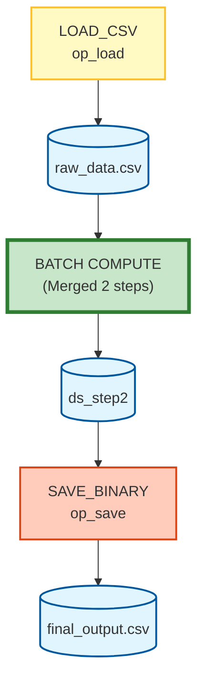

```mermaid
graph TD
    classDef dataset fill:#e1f5fe,stroke:#01579b,stroke-width:2px,rx:5,ry:5;
    classDef op fill:#fff9c4,stroke:#fbc02d,stroke-width:2px;
    classDef batch fill:#c8e6c9,stroke:#2e7d32,stroke-width:4px;
    classDef barrier fill:#ffccbc,stroke:#d84315,stroke-width:2px;
    raw_data.csv[("raw_data.csv")]:::dataset
    ds_step2[("ds_step2")]:::dataset
    final_output.csv[("final_output.csv")]:::dataset
    op_load["LOAD_CSV<br/>op_load"]:::op
    op_load --> raw_data.csv
    batch_op_calc_x["BATCH COMPUTE<br/>(Merged 2 steps)"]:::batch
    raw_data.csv --> batch_op_calc_x
    batch_op_calc_x --> ds_step2
    op_save["SAVE_BINARY<br/>op_save"]:::barrier
    ds_step2 --> op_save
    op_save --> final_output.csv
```