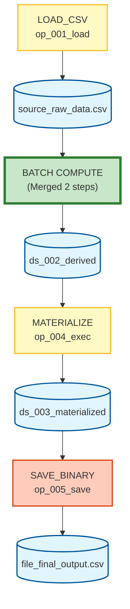

```mermaid
graph TD
    classDef dataset fill:#e1f5fe,stroke:#01579b,stroke-width:2px,rx:5,ry:5;
    classDef op fill:#fff9c4,stroke:#fbc02d,stroke-width:2px;
    classDef batch fill:#c8e6c9,stroke:#2e7d32,stroke-width:4px;
    classDef barrier fill:#ffccbc,stroke:#d84315,stroke-width:2px;
    source_raw_data.csv[("source_raw_data.csv")]:::dataset
    ds_002_derived[("ds_002_derived")]:::dataset
    ds_003_materialized[("ds_003_materialized")]:::dataset
    file_final_output.csv[("file_final_output.csv")]:::dataset
    op_001_load["LOAD_CSV<br/>op_001_load"]:::op
    op_001_load --> source_raw_data.csv
    batch_op_002_compute["BATCH COMPUTE<br/>(Merged 2 steps)"]:::batch
    source_raw_data.csv --> batch_op_002_compute
    batch_op_002_compute --> ds_002_derived
    op_004_exec["MATERIALIZE<br/>op_004_exec"]:::op
    ds_002_derived --> op_004_exec
    op_004_exec --> ds_003_materialized
    op_005_save["SAVE_BINARY<br/>op_005_save"]:::barrier
    ds_003_materialized --> op_005_save
    op_005_save --> file_final_output.csv
```